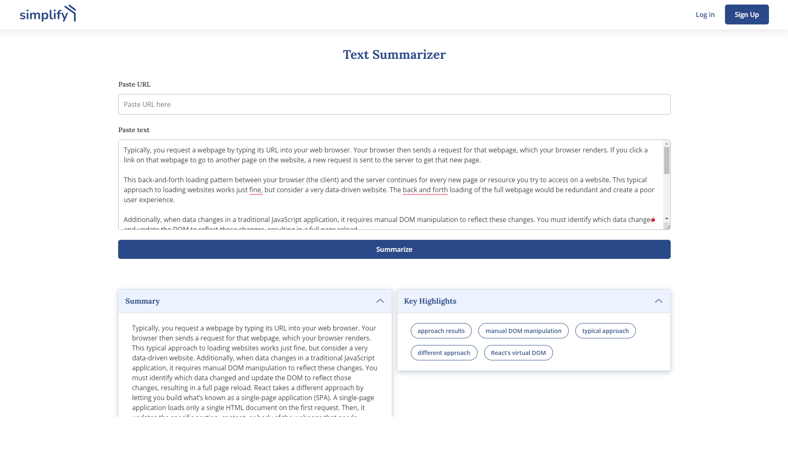

# 🌎 Simplify - API World Hackathon 2022

## 💡 Inspiration
**Problem** In this day and age of social media and digital distractions, many students find it difficult to balance their time. Also, in order to manage their career, school, and personal responsibilities, students have to manage their time effectively. We realized that for those **busy students who don’t have time to read or go through complex and lengthy content**, they need to find a time-saving solution. In addition to not having time, students also have a **difficult time understanding and retaining the main idea**.

**Solution** By utilizing the innovations of natural language processing and web scraping technologies, we’re able to create a more practical method for students to streamline their studying process. As a result, Simplify was developed with the goal of making it **easier for students to comprehend extensive information** and automatically generating flashcards to assist them in **retaining key concepts**.

## 💻 What it does
Simplify is a website productivity application that can take long and tedious text and summarize it for students to easily digest information.

**Text Summarizer & Keyword Extraction**: Users can paste a URL or body text. After clicking the “Summarize” button, the summary text and key highlights would appear on screen for users to read.

**Create Notes**: In order to save the notes, the user must sign up with the system and then login using their credentials. After the login, the user is directed to the notecard page, where the summary and key concepts have already been automatically filled in. Then, they're prompted to create a title for this study set. During this stage, users are also able to create, edit, or delete any terms. After saving and creating their study set, users are able to view their notes on a different page and continue studying their saved notecards.

## ⚙️ How we built it
**Design Process**: We started by defining a problem and performing primary research by conducting user interviews with college students. Following that, we conducted market research by performing competitive analysis in the space of web-based study applications for students, teachers, and online learning communities.After identifying student pain-points and solution features, we then created wireframes, brand styles, and prototyped the web application using Figma.

**Development Process**: We created our backend using Nodejs and Express. Then used mySQL for the database. Lastly, we used React for the clientside.

## 🧩 Challenges we ran into
Had trouble using session storage to persist login for users. Also has trouble coming up with an algorithm to extract all paragraphs from a URL. Initially had a very unoptimized solution, but was able to come up with a slightly better solution.

## 🎉 Accomplishments that we're proud of
Given the 3 week time constraint, we’re able to create this full-stack application from scratch to solve a real world problem while working with people from both software and design backgrounds is something we’re extremely proud of.

## 📖 What we learned
We learned how to leverage APILayer’s NLP and web scraping APIs to help summarize lengthy texts and turn them into notecards for students to study with.

## ❓ What's next for Simplify
Conduct some usability testing with students and further iterate our design and development process based on the results. Explore accessibility for users with assistive technology, visual impairment, or non-fluent English. Creating a feature where students are able to share their flashcards with fellow peers. Even though our main feature is summarizing text to flashcards, we’d love to expand further & uncover other studying techniques & integrate it with Simplify to streamline the studying process for students.

## 🤝 Collaborators

[Jennifer To](https://devpost.com/diem-jenn)

[Brian Lam](https://github.com/lam-brian)

[Nhan Nguyen](https://github.com/nhanng19)

## 🚀 Submission
This project was submitted to the API World Hackathon 2022 [here](https://devpost.com/software/simplify-82ux9o).

You can also try out the [live demo](https://simplify-apiworlds.netlify.app/summarize) by creating an account.